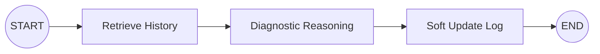

# Semiconductor Agent with Dual-Track Shared Memory

這是一個專為半導體廠（Fab）設計的 AI 代理系統，基於 **SPEC.md** 的架構實作。本系統採用「雙軌記憶更新機制」與「區域共享架構（Section-based Shared Memory）」，旨在平衡即時診斷的極速反應與長期故障排除經驗的累積。

## 核心架構 (Architecture)

本專案將記憶生命週期解耦為三層，並透過兩條路徑進行更新：

1.  **即時路徑 (Hot Path - Agent)**：
    *   **Agent**：使用 LangGraph 驅動，底層推論採用 **Google Gemini 2.5 Flash** 以達成毫秒級診斷。
    *   **Soft Update**：每一輪對話會即時寫入「原始日誌 (Raw Log)」，無損記錄所有工具呼叫與工程師輸入。
2.  **記憶平面 (Memory Plane - VDB)**：
    *   使用 **ChromaDB** 實作。
    *   **區域共享隔離**：以「課/單位 (Section)」作為隔離與共享邊界。同單位的工程師（如 Jason 與 Kevin）共享同一個知識庫，實現跨班別的經驗傳承。
3.  **睡眠路徑 (Sleep Path - Worker)**：
    *   **Sleep Update**：背景工作者定期提取碎片化的原始日誌，利用 LLM 進行 RCA（根本原因分析）與反思。
    *   **知識固化**：將多人經驗提煉為結構化的「長期記憶 (Consolidated Memory)」，並自動清理舊有的冗餘日誌。

## LangGraph 工作流 (Workflow)

本系統的核心推論引擎採用 **LangGraph** 進行狀態編排，確保診斷流程與記憶記錄的嚴謹性：

1.  **Retrieve Node (檢索節點)**：
    *   根據目前的設備數據與工程師輸入，自動在 ChromaDB 中進行語意搜尋。
    *   **關鍵點**：它會同時撈取「他人的原始日誌」與「系統固化知識」，為 Agent 提供完整的背景脈絡。
2.  **Agent Node (診斷節點)**：
    *   使用 **Gemini 2.5 Flash** 進行邏輯推理。
    *   結合「檢索到的歷史」與「當前異常數據」，產出專業的診斷建議與維修步驟。
3.  **Soft Update Node (軟更新節點)**：
    *   **非同步攔截**：在回傳結果給工程師的同時，攔截本輪的對話內容與 Tool Call 軌跡。
    *   **無損記錄**：將這些碎片化資訊立即寫入 VDB 的 `raw_log`，確保 100% 的可追溯性，不阻塞前端回應。



## 主要組件 (Components)

*   `agent.py`：診斷代理核心。包含 `diagnostic_agent_node` (分析建議) 與 `soft_update_node` (即時日誌記錄)。
*   `memory.py`：向量資料庫封裝。負責處理基於 `section_id` 的命名空間管理，支援 Raw Log 與 Consolidated 兩種資料存取。
*   `worker.py`：睡眠更新工作者。負責後台的知識提煉與記憶固化。
*   `dashboard.py`：基於 FastAPI 的 Web 記憶看板。讓工程師可以視覺化地查看到課內「正在發生什麼 (Raw Logs)」以及「我們學到了什麼 (Consolidated Knowledge)」。
*   `main.py`：完整功能示範腳本。模擬多位工程師在同區域內的協作與記憶演進。

## 快速啟動 (Quick Start)

### 1. 安裝環境
```bash
python -m venv venv
.\venv\Scripts\Activate.ps1
pip install -r requirements.txt
```

### 2. 配置設定
請在 `.env` 檔案中加入你的 API Key：
```text
GEMINI_API_KEY=你的_GEMINI_API_KEY
```

### 3. 執行示範
啟動看板（另開視窗）：
```bash
python dashboard.py
```
執行主示範流程（包含互動暫停點）：
```bash
python main.py
```

## 設計原則 (Design Principles)
*   **Decoupling**：分離即時推論與高階認知整合。
*   **Collaboration**：透過 Section 級別的記憶共享提升團隊協作。
*   **Traceability**：所有對話與工具紀錄均可追溯。
*   **Performance**：利用 Gemini Flash 確保生產線要求的低延遲。
